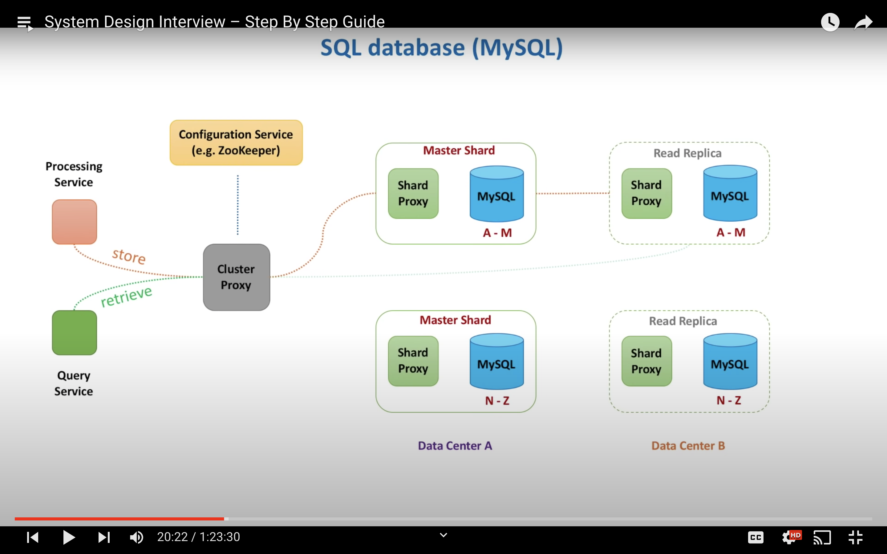

Things to consider while making design decisions and **trade offs** [CAPSS]:
1. Consistency
2. Availability
3. Performance - fast reads and fast writes. Internal trade offs might be required here as some problems can't support both. Work with interviewer to choose.
3. Scalability
4. Security
5. Extensibility - how extensible is the data model. can you change data model
6. Expense - cost involved 
7. Recovery - how to recover data in case of outage

Source: https://www.youtube.com/watch?v=bUHFg8CZFws
Example: ATMs storing balance info on themselves as a distributed system and syncing after every transaction. What do you do if one ATM goes down?
Options:
1. Consistency first: Allow no operation on the other ATM to maintain 100% Consistency at all times. (Bad for business / user)
2. Availability first: Allow operation and sync once the first ATM is online

Option 2 is better and mostly preferred. Issue:
What if the network failure or issue in ATM 1 was when a user withdrew all money and that sync was never sent to ATM 2 as ATM 1 went down immediately?

Some Solutions:
1. (Strict) Allow only deposits on ATM 2 in such condition (no withdrawls as balance might go negative)
2. Allow withdrawls but in small amounts
3. Penalize people misusing the system - negative balances

===

Highly scalable, performant & available system: 
